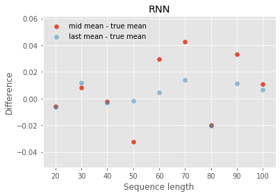

####First experiment: 
we are given 5000 sequences (with 52 points each) in training that all coincide in positions 5-9 (call it shape A) and $Y_10 ~ N(1, 0.6)$ (middle histogram). 30 out of the 5000 sequences (coloured) have the same y-values corresponding to positions 5-9 at the 45th-50th positions. Although these 30 sequences end with a r.v $P(Y_52| shape A)$ which is equivalent to $P(Y_10| shape A)$, the values seen in training look like it is sampled from $N(0, 0.3)$. In the test set, it is clear that $P(Y_10| shape A)$ and $P(Y_52|shape A)$ share the same distribution.       

Q1. Can a classic GRU model learn that $P(Y_10|shape A)$ and $P(Y_52|shape A)$ are the same? Yes it does learn the means to be the same and the std is XXX.    

  

Q2. What will be the conditional distribution $P(Y_10| shape A)$ if we don't have just 30 sequences with the last R.V sampled from $N(0, 0.3)$, but 1000, 5000? The classic RNN will learn the means of the two conditional distributions, but will overestimate the std -- both get 0.7 std for 52 length sequence. The shorter the sequences are the higher is the overestimation of the std as is shown in XXX. Suprisingly, a classic decoder-transformer does not do better on the task when the number of sequences is equal as seen in XXX.   

##### RNN

##### GPT

Let's review another example:

From the previous example. it seems like the RNN can learn the means, but overestimate the std. of the later shape. 

##### RNN w/ one-hot

##### RNN w/ embedding

Q3. Conversely, if $P(Y_52|shape A)$ is sampled from $N(0, 0.3)$ we want to differentiate the distributions in the 10th position and the 52nd position. How would we do that even when we only have 30 sequences to indicate it? 

Q4. Would an RNN with one-hot encoding of position 
(1, 2, 3, ..., 52)? would an RNN with embedding layer of the positions work? Would a classic decoder-Transformer model work?     

#####GPT

####Second experiment:  
we are given 1000 sequences (of length N). The first 10% of 500 of these sequences start with the same shape and end with r.v A sampled from N(-4, 0.5). The other sequecnes don't have the same starting 10% and end in r.v B sampled from N(-2, 0.3). If we only compute the loss of the last output in a sequence, can we learn these conditional distributions? and for what length of sequences?      

#####RNNs

##### GPT

* RNNs memory seems to be capped at 40 steps to remember previous shapes. This means that shapes less than 40 steps away will influence the desired distribution -- see first experiment. Q. why is the log-likelihood pushes the mean first rather than the std.? 

####Third experiment:
hypothesis --- without y's in the attention matrix, there is no chance to attribute similar dist. to a repeated shape if it is not considered 'close'. 

####Observations:
* a residual network means I want to consider all shapes with same differences among points. Another way to put it, the height of the observed shape is irrelevant. This is a choice that needs to be taken based on the task characteristics. 
* How can the uncertainty increase over time? 
* If RNN overestimates the std, it means it already has some prior
* If we want to have a prior we just need to augmnet the data appropriately.

